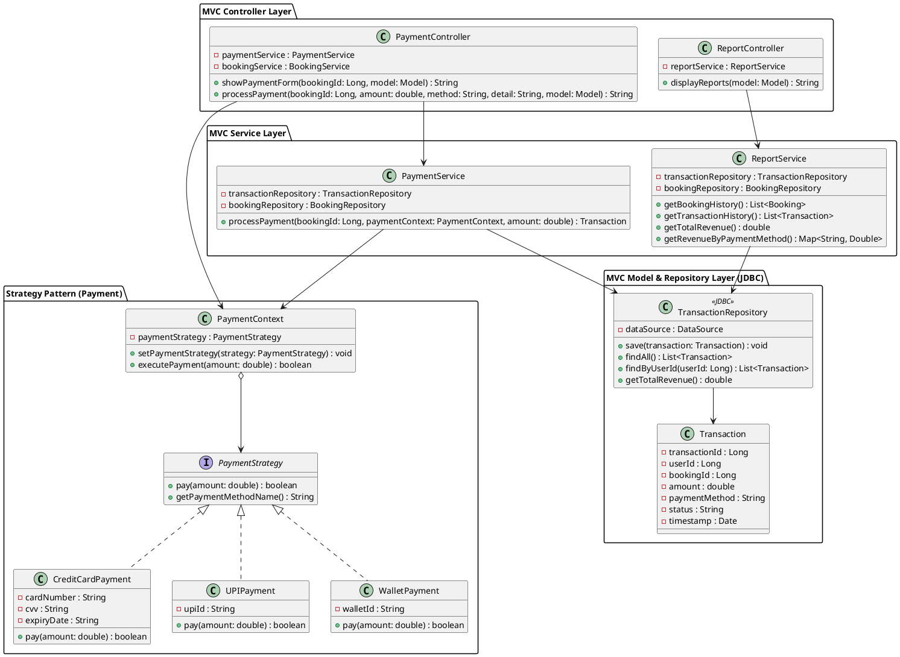
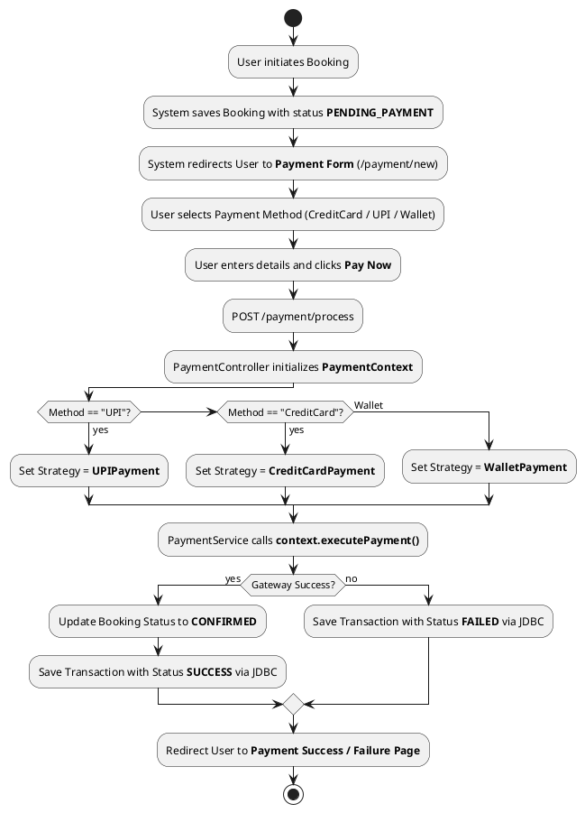
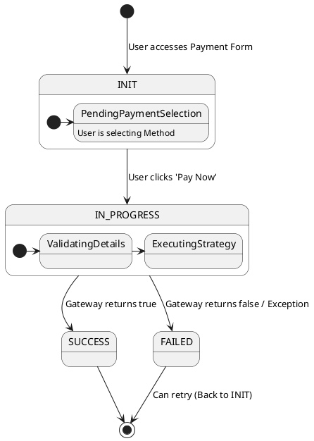

# UML Diagrams for Payment and Reports Module

Here is the requested UML documentation in PlantUML format.

## 1. Class Diagram (Payment & Reports)

## 2. Activity Diagram (Payment Flow)

## 3. State Diagram (Transaction States)

