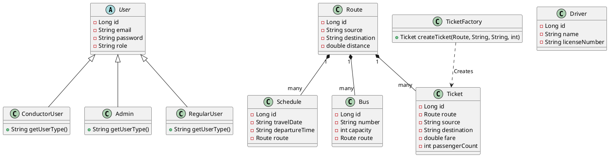
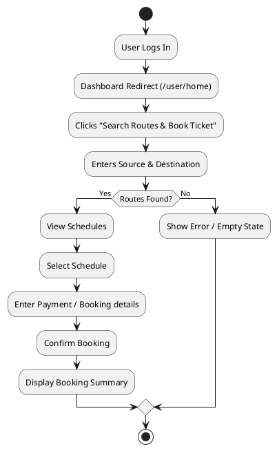
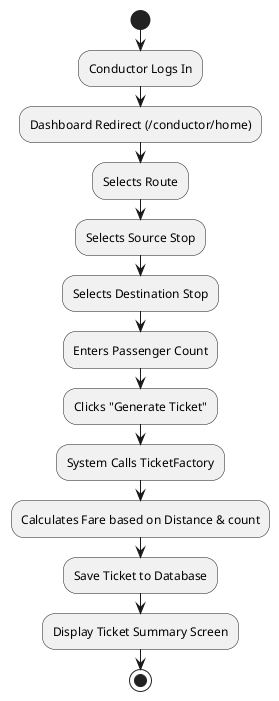
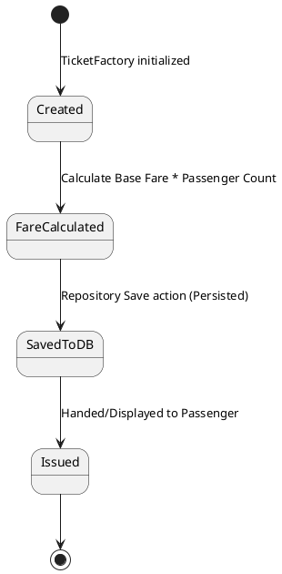

# BMTC Extension UML Diagrams

Here are the requested UML diagrams rendered with PlantUML.

## 1. Updated Class Diagram

## 2. Activity Diagrams

### User Booking Flow

### Conductor Ticket Flow

## 3. State Diagram

### Ticket Lifecycle

